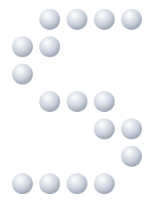

<p align="center">
  
</p>

<h1 align="center">Sovegent Identity</h1>

<p align="center">
  <strong>Identity & Verification SDK for the Sovegent ecosystem</strong><br/>
  Prove claims without exposing data. Sign, timestamp, and verify everything.
</p>

<p align="center">
  <a href="LICENSE"></a>
  <a href="https://github.com/sovegent/sovegent-identity"></a>
  
</p>

---

## What is Sovegent Identity?

Sovegent Identity is the **identity and verification layer** of the Sovegent ecosystem.

It allows users, agents, and systems to **prove claims without exposing sensitive data**. Using wallet signatures, cryptographic proofs, and zero-knowledge methods, it enables proving identity, ownership, eligibility, and credentials in a privacy-preserving way — with no central authority required.

Everything is validated through **verifiable proof**.

### The Sovegent Ecosystem

| Product | Role |
|---|---|
| **Sovegent** | Infrastructure & execution layer |
| **Sovegent Wallet** | Non-custodial multi-chain wallet (key ownership) |
| **Sovegent Identity** | Identity, attestations & verification (you are here) |

---

## Features

- **Document Notarization** — SHA-256 hash + sign + timestamp any document
- **Signed Attestations** — issue W3C-aligned verifiable claims about any subject
- **Zero-Knowledge Proofs** — prove attributes (age, eligibility) without revealing the raw value
- **Chain-Agnostic** — works offline; optionally anchor proofs on EVM, Liberland, or Bitcoin
- **Wallet-Agnostic** — works with Sovegent Wallet but not coupled to it; bring any secp256k1 or Ed25519 key
- **Noble Crypto** — uses `@noble/hashes` and `@noble/curves` throughout (audited, zero dependencies)

---

## Packages

```
sovegent-identity/
├── packages/
│   ├── core/        @sovegent/core     — hashing, signing, types, attestations, notarization
│   ├── zk/          @sovegent/zk       — zero-knowledge proof generation and verification
│   ├── anchors/     @sovegent/anchors  — pluggable chain anchoring (EVM, Liberland)
│   └── sdk/         @sovegent/sdk      — unified consumer API (imports all of the above)
├── circuits/                             — circom ZK circuits
├── docs/                                 — setup guides and architecture docs
└── examples/                             — runnable usage examples
```

---

## Quick Start

```bash
pnpm add @sovegent/sdk
```

### Notarize a document

```ts
import { SovegentIdentity } from "@sovegent/sdk";

const lp = new SovegentIdentity({
  signer: {
    privateKey: "0xabc...",
    algorithm: "secp256k1",
    verificationMethod: "0xYourWalletAddress",
  },
});

const record = lp.notarize({
  data: new Uint8Array(fileBytes),
  mimeType: "application/pdf",
  label: "Employment Contract",
});

console.log(record.documentHash); // SHA-256 of the file
console.log(record.proof);        // cryptographic proof of timestamp + signer
```

### Issue an attestation

```ts
const attestation = lp.attest({
  subject: "0xSubjectAddress",
  claim: { isOver18: true, nationality: "Liberland" },
  expiresAt: "2026-12-31T00:00:00Z",
});

// Share the attestation. Anyone can verify it:
const result = lp.verify(attestation, issuerPublicKey);
console.log(result.valid); // true
```

### Anchor on-chain (optional)

```ts
import { EvmAnchorAdapter } from "@sovegent/anchors";

const adapter = new EvmAnchorAdapter({ publicClient, walletClient, chainName: "ethereum" });
const anchored = await lp.anchor(record, adapter);
console.log(anchored.anchor?.txHash);
```

---

## Zero-Knowledge Proofs

Prove attributes without revealing underlying data. Example: prove you are over 18 without disclosing your birth date.

See [docs/zk/setup.md](docs/zk/setup.md) for circuit compilation and proof generation.

---

## Anchoring Guides

- [EVM chains (Ethereum, Polygon, etc.)](docs/anchors/evm.md)
- [Liberland Blockchain](docs/anchors/liberland.md)

---

## Architecture

```
┌─────────────────────────────────────────────────────┐
│                   @sovegent/sdk                   │
│              (unified consumer API)                 │
└──────────────┬─────────────────┬───────────────────┘
               │                 │
    ┌──────────▼───────┐ ┌───────▼──────────┐
    │ @sovegent/core │ │  @sovegent/zk   │
    │ hashing, signing │ │  ZK proof gen/ver │
    │ attestations     │ │  circom circuits  │
    │ notarization     │ └──────────────────┘
    │ W3C VC types     │
    └──────────┬───────┘
               │
    ┌──────────▼──────────────────────────┐
    │         @sovegent/anchors         │
    │  EVM adapter │ Liberland adapter    │
    └─────────────────────────────────────┘
```

---

## Design Principles

- **Offline-first** — all proofs work without a network call
- **Verifier-independent** — no Sovegent Identity server needed to verify
- **W3C aligned** — compatible with the Verifiable Credentials Data Model
- **Noble crypto** — same audited primitives as Sovegent Wallet

---

## License

**AGPL v3** — if you run a modified version of Sovegent Identity as a service,
you must publish the source. See [LICENSE](LICENSE).

Part of the [Sovegent](https://github.com/sovegent) ecosystem.

---

## Contributing

Sovegent Identity is in alpha. Issues, circuit contributions, and anchor adapters welcome.

```bash
git clone https://github.com/sovegent/sovegent-identity.git
cd sovegent-identity
pnpm install
pnpm build
pnpm test
```
